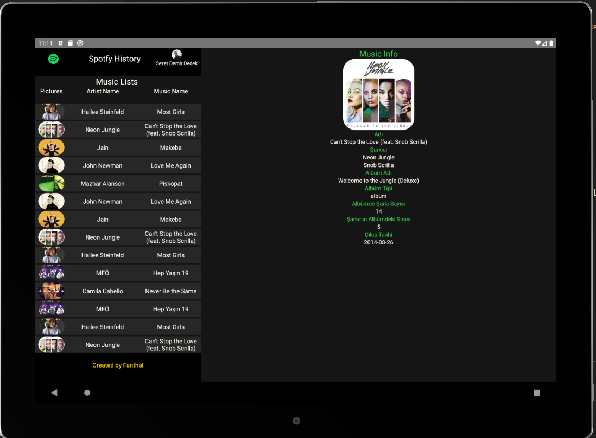
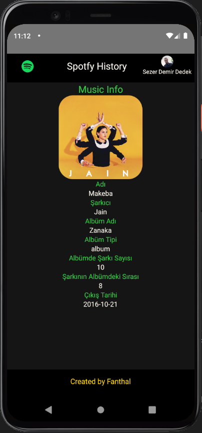

# React-Native-Demo
Stajımda React Native öğrenme ve mantığını kavrama için yaptığım bir uygulama.
Uygulamada Spotfy Api sisteminin yardımı ile anlık çalan şarkıların listelendiği bir liste oluşturuyor.
(Daha geliştirme aşamasında eklemeler yapılacaktır.)
## Kullanım

Öncelikle "myMobileApp" içerisindeki "src" klosöründe "variables.tsx" dosyasının gereksinimlerini ayarlayın.

### Gerekenler
* Android Studio
* Node.js
* (Tercihen) IOS için mac

### Çalıştırma

* Android üzerinde çalıştırma için 
```bash
npx react-native run-android
```

* IOS üzerinde çalıştırma için 
```bash
npx react-native run-ios
```

## Ekran görüntüleri
Ekran görüntüleri sadece Android cihazlar üzerinden alınmıştır.

### Tablet 
<p align="center">
  
</p>

### Telefon 
<p align="center">
  
</p>
<p align="center">
  
</p>
